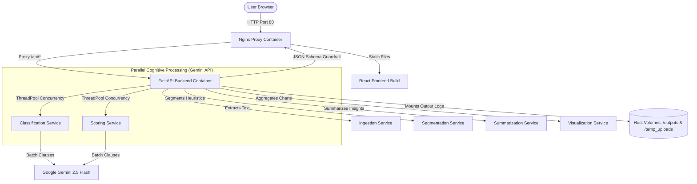

# Contract Risk Analyzer

An agentic, multi-agent legal auditing engine designed to ingest contract documents (PDF, DOCX, TXT, MD), segment them into clauses, classify legal exposure, assign risk scores (1–9) against a YAML-defined rubric, and render structured dashboards, Heatmaps, and executive summaries.

Built in accordance with Google's **Agentic Engineering / 5-Day White Papers** specifications.

---

## 🎨 Visual Design & UX Aesthetics

The user interface is designed with a premium, state-of-the-art **Glassmorphic Cyber-Dark Theme** that prioritizes cognitive clarity and visual elegance:

*   **Color Palette**: Sleek dark slate backgrounds (`#0d1117`) paired with glowing accent highlights (Emerald Green for Low Risk, Amber for Medium Risk, and Vibrant Crimson/Coral for High Risk).
*   **Dynamic Executive Gauge**: A semi-circular glowing SVG gauge representing the overall calculated contract risk score (1–9).
*   **Interactive Risk Heatmap**: A visual 8x10 matrix representing the taxonomy distribution of segmented clauses, styled with subtle micro-animations and hover transitions for rapid compliance scanning.
*   **Split-Pane Layout**: An intuitive workspace consisting of:
    - **Sidebar**: Interactive metric cards showing the breakdown of total analyzed clauses and risk tiers.
    - **Main Content**: Dynamic tab switches between the executive summary (Synthesized Legal Report & Action Plan) and the full interactive clause inventory.
- **Glassmorphism Elements**: Translucent frosted panels (`backdrop-filter: blur(12px)`) with thin, refined borders to look premium and avoid browser-default aesthetics.

---

## 🏗️ System Architecture

The application is containerized using Docker and runs as two main services coordinated by a reverse-proxy routing layer:



### Services & Data Flow:
1.  **Nginx Proxy Container (Frontend Port 80)**: Serves the static built React SPA, redirects backend API traffic to the FastAPI application, and manages file limits (up to 50MB) via `client_max_body_size 50M;`.
2.  **FastAPI Backend Container (Port 8000)**: Serves the analysis endpoints, runs the multi-agent cognitive loop, and interacts with the Google Gen AI API.
3.  **Concurrency Pool**: Employs a robust `ThreadPoolExecutor` targeting `15` concurrent classification workers and `10` concurrent scoring workers, implementing automated retries, timeout protections (45-60s), and defensive placeholder fallbacks to survive API rate-limits.
4.  **Host Volumes**: Mounts the host `outputs/` and `temp_uploads/` folders, ensuring that all processing logs, parsed schemas, and execution trajectories are persistent and accessible on the host machine.

---

## 📖 Kaggle 5-Day White Paper Alignment

This application is built as a textbook reference implementation of the specifications defined in the Google/Kaggle White Papers:

| Specification Sheet | Core White Paper Concept | Project Implementation |
| :--- | :--- | :--- |
| **Day 1: The New SDLC** | Harness-driven development and factory execution. | The orchestrator harness (`main.py`) controls execution flow, validates constraints, and executes scripts programmatically. Developer output is shifted from raw scripting to schema definition (`/specs`). |
| **Day 2: Interoperability** | Structured Agent-to-Agent (A2A) and Agent-to-UI (A2UI) communications. | System scripts interact using typed JSON schemas defined in `specs/message_schema.json`. Orchestrator compiles execution outputs directly into standard JSON payloads (`charts.json`, `report.json`), which are directly read by the React dashboard without custom UI parsing. |
| **Day 3: Agent Skills** | Skills portability, versioning, and folder isolation. | divided logic into portable folders under `skills/` (Ingestion, Segmentation, Classification, Scoring, Summarization, Visualization). Each skill implements the mandated spec: `VERSION`, `SKILL.md`, `scripts/`, `references/`, and `tests/`. |
| **Day 4: Security & Eval** | Observability logs, LLM Guardrails, and automated evaluation datasets. | 1. **Observability**: Logs every action, thought, execution time, and tokens to `outputs/trajectory.json`. <br>2. **Guardrails**: Enforces output validation against `specs/contract_clause_schema.json` before returning payloads.<br>3. **Evaluation**: Features an automated accuracy runner (`scratch/run_eval_test.py`) that scores predictions against a `golden_dataset.json` baseline. |
| **Day 5: Spec-Driven (SDD)** | Specs as single source of truth; context hygiene and batch operations. | 1. **Specs Root**: Canonical specification files, rubrics (`risk_scoring_rubric.yaml`), schemas, and Gherkin BDD specs (`contract_risk_analyzer.feature`) live in `specs/`. <br>2. **Context Hygiene**: Rather than making 100+ separate LLM queries, clauses are parsed and batched concurrently in threads using structured JSON schemas, compressing hours of analysis into seconds. |

---

## 📂 Project Directory Structure

```
Contract-Risk-Analyzer/
├── backend/
│   └── app.py                  # FastAPI Server
├── frontend/
│   ├── index.html              # HTML shell (glowing Glassmorphism theme)
│   ├── src/
│   │   ├── App.jsx             # React UI Dashboard (responsive workspace & heatmap)
│   │   ├── index.css           # Vanilla CSS Styling & Visual Tokens
│   │   └── main.jsx            # React mounting
│   ├── nginx.conf              # Nginx config (client size limits & API proxy)
│   ├── Dockerfile              # Multi-stage frontend compilation & runner
│   └── package.json
├── skills/                     # Modular Agent Skills (Anatomy Compliant)
│   ├── Ingestion/              # Text extractor (PDF, DOCX, TXT)
│   ├── Segmentation/           # Header-based paragraph chunker
│   ├── Classification/         # Concurrent Gemini Taxon Classifier
│   ├── Scoring/                # Concurrent Gemini Rubric Evaluator
│   ├── Summarization/          # Action Plan generator
│   └── Visualization/          # Matrix and heatmap data aggregator
├── specs/                      # Single Source of Truth
│   ├── Contract_Risk_Analyzer_SRS.md
│   ├── contract_clause_schema.json
│   ├── message_schema.json
│   ├── risk_scoring_rubric.yaml
│   ├── contract_risk_analyzer.feature (Gherkin BDD specs)
│   ├── golden_dataset.json     # Accuracy baseline
│   └── trajectory_schema.json  # Observability schema
├── Contract/
│   └── sample_contract.pdf     # Sample Contract Document
├── outputs/                    # Output logs (trajectory, report, charts)
├── docker-compose.yml          # Container stack orchestrator
├── Dockerfile.backend          # Backend Docker image spec
├── requirements.txt            # Python requirements
├── .gitignore                  # Root gitignore excluding local caches/secrets
└── README.md
```

---

## 🚀 Setup & Execution Instructions

### Option A: Running with Docker Compose (Recommended)

This option spins up the complete production-ready stack in separate containerized environments. No local Node.js or Python environment setup is required.

1.  **Configure API Key**:
    Ensure a `.env` file exists in the root directory:
    ```env
    GEMINI_API_KEY=YOUR_GEMINI_API_KEY
    ```
2.  **Start Services**:
    From the root directory, build and launch the containers:
    ```bash
    docker compose up --build -d
    ```
    This launches:
    *   **Frontend (Nginx & React SPA)** on `http://localhost` (Port 80)
    *   **Backend (FastAPI)** on `http://localhost:8000` (Port 8000)
3.  **Stop Services**:
    ```bash
    docker compose down
    ```

---

### Option B: Running Bare-Metal (Local Development)

Use this option to run without Docker (e.g., if you are modifying frontend CSS/React files or Python backend endpoints locally).

#### 1. Backend Setup
1.  **Configure API Key**: Add `GEMINI_API_KEY` to your local shell or a `.env` file in the root.
2.  **Install Python Dependencies**:
    ```bash
    pip install -r requirements.txt
    ```
3.  **Run FastAPI Backend**:
    ```bash
    python backend/app.py
    ```
    The backend server will listen on `http://127.0.0.1:8000`.

#### 2. Frontend Setup
1.  **Install dependencies**:
    ```bash
    cd frontend
    npm install
    ```
2.  **Start Dev Server**:
    ```bash
    npm run dev
    ```
    The React application will launch locally at `http://localhost:5173/` and dynamically communicate with the backend.

---

## 🧪 Running Verification Tests

The project includes both programmatic models evaluation tests and end-to-end user interface integration checks:

### 1. Model & Data Schema Evaluation
Verify the accuracy of the multi-agent cognitive classification and scoring logic against the golden baseline dataset:
```bash
python scratch/run_eval_test.py
```
This processes a mock dataset, triggers the Gemini evaluation pipeline, performs validation against `contract_clause_schema.json`, and outputs deviation statistics.

### 2. End-to-End UI Integration Test
Verify the complete web pipeline (uploading, API call routing, rendering, and performance verification) using headless Puppeteer browser scripts:

*   **For Docker Compose Stack** (Tests the app hosted on port `80`):
    ```bash
    node frontend/test_docker_ui.cjs
    ```
*   **For Local Bare-Metal Setup** (Tests the app hosted on port `5173`):
    ```bash
    node frontend/test_ui.cjs
    ```

Upon successful completion, these tests capture screenshots showing the fully rendered dashboard, dynamically named based on the input file base name, saved to:
*   `[contract_name]_docker_dashboard.png` (Docker run)
*   `[contract_name]_dashboard.png` (Bare-metal run)
